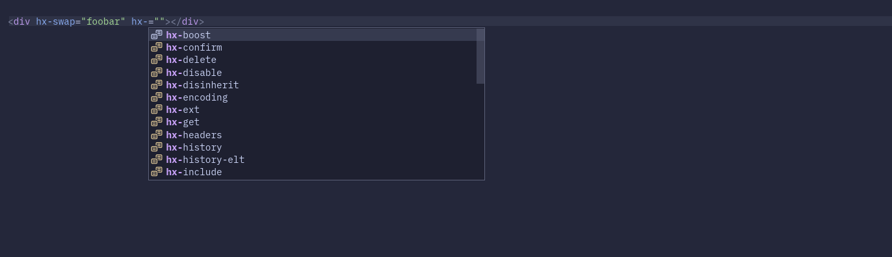

# htmx-Tags

htmx-Tags is a VSCode extension that provides autocompletion of htmx attributes and inline documentation for these attributes. The documentation for the attributes are fetched and parsed from the official documentation.

## Installation

You can install the `htmx-tags` extension from the Visual Studio Code Marketplace or by searching for "htmx-tags" within the VSCode extension panel.
Usage

After installing the extension, simply start typing an htmx attribute within an HTML tag and the extension will provide autocompletion suggestions based on the official htmx documentation.

Additionally, you can hover over an htmx attribute to see inline documentation within your code editor.

## Features

* Autocompletion of htmx attributes
* Inline documentation for htmx attributes

## Screenshots

## Contributions

Contributions to the htmx-Tags extension are welcome!

If you would like to contribute, please submit a pull request or open an issue on the GitHub repository.

## License

htmx-Tags is licensed under the Apache 2 License. See the LICENSE file for more information.

The htmx documentation is licensed under the BSD 2-clause license.
